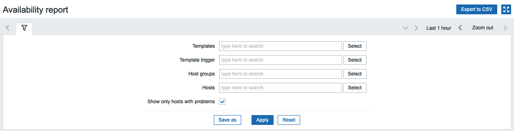

# zabbix-module-avail-report
Written according to Zabbix official documentation [Modules](https://www.zabbix.com/documentation/current/en/devel/modules/file_structure)

A Zabbix module to add new features to "Availability Report":
1) Export to CSV.
2) Report only hosts with availability less than 100% for given time period.
3) 'By host' and 'By trigger template' merged into one page.
4) Multiselect instead of drop-down filters provide much more flexibility.
5) Filters can be saved for later use.

NOTE: if "Show only hosts with problems" is not checked then tags assigned to Templates triggers came from are not shown. This would cause significant performance impact.

# How to use
IMPORTANT: pick module version according to Zabbix version:
| Module version | Zabbix version |
|:--------------:|:--------------:|
|     v1.0.2     |     5.4        |
|     v1.0.2     |     6.0        |
|     v2.0.0     |     6.2        |
|     v3.0.0     |     6.4        |

1) Create a folder in your Zabbix server modules folder (by default /usr/share/zabbix/) and copy contents of this repository into that folder.
2) Go to Administration -> General -> Modules click Scan directory and enable the module.
3) New Availability report is available under Reports -> Availability report BG menu.

## Authors
See [Contributors](https://github.com/BGmot/zabbix-module-latest-data/graphs/contributors)

